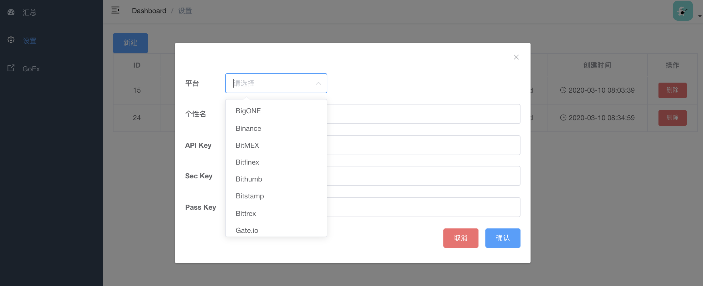

# Crypto Assets

[](https://travis-ci.com/goex-top/cryptoassets)

统计你的个人资产


## 缘由
FCoin 跑路时，提币需邮件回复账户里资金数量，有多少人能知道自己资金具体数目？难。

## 快速上手
打开工具时自动记录其各平台账户资金数目，统计其占比

### 编译
> 安装`go`
* `git clone https://github.com/goex-top/cryptoassets.git`
* `git submodule update --init --recursive`
* `go build`

### 运行
* `./cryptoassets`
* 打开浏览器访问 [http://localhost:9000](http://localhost:9000)
* 输入配置文件`config.toml`中的用户名与密码

### 添加API KEY
在Web设置中添加平台的KEY


## 配置
创建一份`config.toml`配置文件，如`cp sample-config.toml config.toml` ，修改其内容

```toml
proxy=""                 # socks5://127.0.0.1:1080
freq=60                  # unit: second, 60 for 1min
debug = true             # enable / disable verbase log print
[user]
username="admin"         #  username for login
password="AbcdEfgh"      # password for login and encrypts and decrypts your apiseckey to store in database
```

## 密钥存储
* 用户创建交易所时，密钥会通过AES(ECB)加密后存储至数据库中，切记`toml`配置文件中的`password`，这个`password`是解密数据库中密钥的唯一密码。
* 尽量创建只读API KEY

## 数据库
ORM库采用[GORM](https://github.com/jinzhu/gorm), 支持`MySQL`, `PostgreSQL`, `Sqlite3`, `SQL Server` 
目前使用`sqlite3`存储, 数据库文件自动创建, **方便**

### 数据库模型
3张表
* 账户
  - 用于存储用户不同平台的API KEY
* 历史资产。 各个平台的资产总计，每隔一段时间(根据配置中的freq)存储
  - 资产有BTC, USD, USDT, CNY估值
* 历史币数。各个平台中的币种明细
  - 明细中有BTC, USD, USDT, CNY估值

```sql
CREATE TABLE accounts (
    id               INTEGER       PRIMARY KEY AUTOINCREMENT,
    created_at       DATETIME,
    updated_at       DATETIME,
    deleted_at       DATETIME,
    nick_name        VARCHAR (255) UNIQUE,
    exchange_name    VARCHAR (255),
    api_key          VARCHAR (255),
    api_secret_key   VARCHAR (255),
    api_passphrase   VARCHAR (255),
    last_update_time BIGINT
);

CREATE TABLE assets (
    id         INTEGER  PRIMARY KEY AUTOINCREMENT,
    created_at DATETIME,
    updated_at DATETIME,
    deleted_at DATETIME,
    account_id INTEGER,
    btc        REAL,
    usdt       REAL,
    usd        REAL,
    cny        REAL,
    btc_usdt   REAL,
    btc_usd    REAL,
    btc_cny    REAL,
    usdt_usd   REAL,
    usdt_cny   REAL,
    usd_cny    REAL
);

CREATE TABLE coin_assets (
    id            INTEGER       PRIMARY KEY AUTOINCREMENT,
    created_at    DATETIME,
    updated_at    DATETIME,
    deleted_at    DATETIME,
    asset_id      INTEGER,
    coin_name     VARCHAR (255),
    amount        REAL,
    frozen_amount REAL,
    btc           REAL,
    usdt          REAL,
    usd           REAL,
    cny           REAL
);

```

## 目前支持平台
平台 | 现货 | 期货(合约) | 期货(永续) | LOGO
:-: | :-: | :-: | :-: | :-: 
[BitMEX](https://www.bitmex.com/register/tIRSfz) | | ☑️ | ☑️ | [](https://www.bitmex.com/register/tIRSfz) |
[Binance](https://www.binance.com/?ref=10052861) | ☑️|  | ☑️ | [](https://www.binance.com/?ref=10052861) |
[OKEx](https://www.okex.com) | ☑️ | ☑️ | ☑️ |[](https://www.okex.com) |
[Huobi](https://www.huobipro.com/zh-cn/topic/invited/?invite_code=n6d33) | ☑️| ☑️ |  | [](https://www.huobipro.com/zh-cn/topic/invited/?invite_code=n6d33) |
[Poloniex](https://www.poloniex.com/?utm_source=goex&utm_medium=web) | ☑️|  |  | [](https://www.poloniex.com/?utm_source=goex&utm_medium=web)|
[Bitfinex](https://www.bitfinex.com) | ☑️|  |  | [](https://www.bitfinex.com)|
[Bitstamp](https://www.bitstamp.net) | ☑️|  |  | [](https://www.bitstamp.net) |
[Bittrex](https://bittrex.com) | ☑️|  |  | [](https://bittrex.com) |
[Bithumb](https://www.bithumb.com) | ☑️|  |  | [](https://www.bithumb.com)|
[GateIO](https://www.gate.io/signup/330917) | ☑️|  |  | [](https://www.gate.io/signup/330917)|
[ZB](https://www.zb.com) | ☑️|  |  | [](https://www.zb.com)  |
[BigONE](https://b1.run/users/new?code=7JDU9ANL) | ☑️|  |  | [](https://b1.run/users/new?code=7JDU9ANL)  |
[HitBTC](https://hitbtc.com/) | ☑️|  |  | [](https://hitbtc.com/) |

**工具会将支持平台的账户资金拉取进行合并**

## 汇率
* USD/CNY 从[雅虎财经](https://finance.yahoo.com/)获取
* USDT/USD 从[Binance US](https://www.binance.us/en/trade/USDT_USD)获取
* BTC/USD 从[Binance US](https://www.binance.us/en/trade/BTC_USD)获取

**更新周期为2小时**

## 前端源码
如果想修改web源码，请查看仓库`https://github.com/goex-top/cryptoassetsweb.git`

## 咖啡一杯
如果对你有用，可为作者买一杯咖啡/一碗热干面

<p align="center">
  <a href="https://raw.githubusercontent.com/goex-top/cryptoassets/master/alipay.png">
    
  </a>
  <a href="https://raw.githubusercontent.com/goex-top/cryptoassets/master/wechat.png">
      
    </a>
</p>
